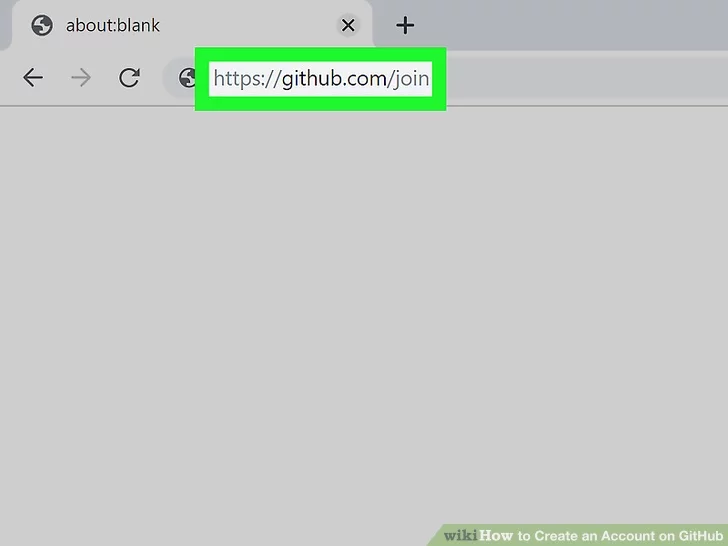
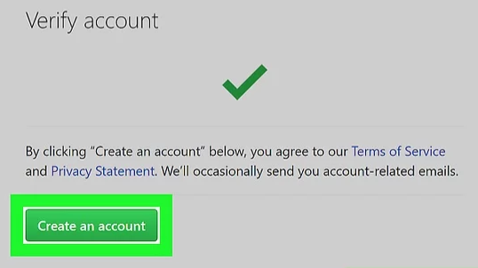
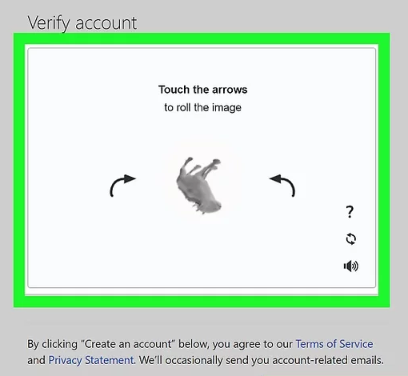
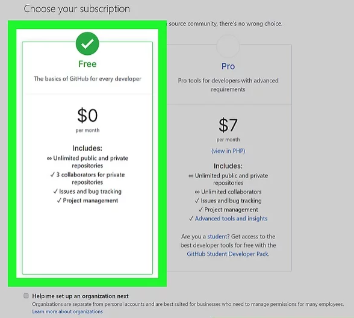
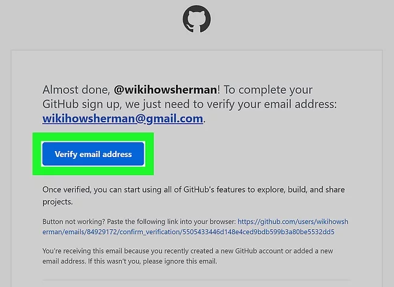
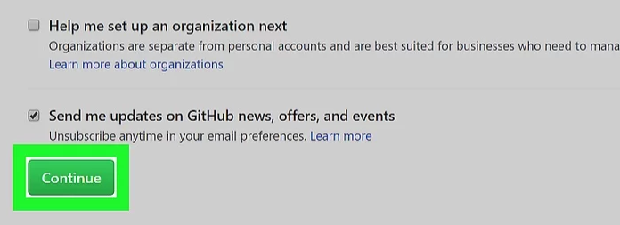
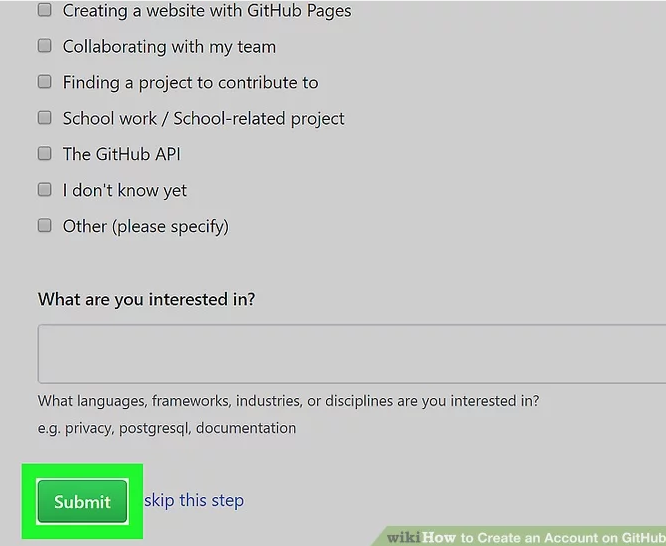

# TTP Summer 2021 Externship
## Session 1: Introduction and First Steps

---
# Create a GitHub account
## Step 1: Go to https://github.com/join

---

# Create a GitHub account
## Step 2: Enter your personal details

---

# Create a GitHub account
## Step 3: Click the green 'Create an account' button

 

---

# Create a GitHub account
## Step 4: Complete the CAPTCHA puzzle

---

# Create a GitHub account
## Step 5: Click the 'Choose' button for the FREE plan

---

# Create a GitHub account
## Step 6: Click the 'Verify email address' button

---

# Create a GitHub account
## Step 7: Click 'Continue'

 

---

# Create a GitHub account
## Step 8: Select your preferences and click 'Submit'

 

---
# Other git resources

Official git cheatsheet:  
[https://education.github.com/git-cheat-sheet-education.pdf](https://education.github.com/git-cheat-sheet-education.pdf)

Code Academy lessons:  
[https://www.codecademy.com/learn/learn-git](https://www.codecademy.com/learn/learn-git)

---

# Pause for Questions
## & quick Thumb Poll check-in

---
# We Want to Know
## Breakout and Give Us Your Thoughts!

Tier List Game